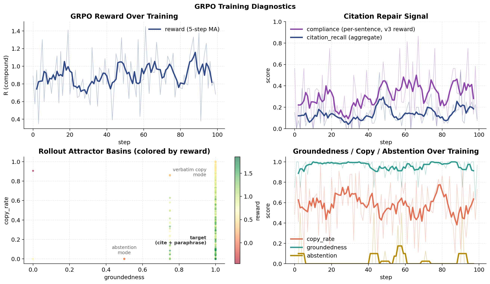

# Grounded RAG via RL for Mental Health

RL post-training of a RAG generator to stay faithful to retrieved
evidence. Single verifier (Cohere LLM-judge), two paths (**DPO**, then
**GRPO**), one domain: factual QA over openly-licensed mental-health
clinical reference text (ICD-11, NIMH).

The project is a small-scale, end-to-end demonstration. It shows the *methodology*: build the verifier,
gate on calibration, ship DPO as a fast baseline, then push GRPO to
observe reward-hacking and repair it with a compound reward.



*Reward trajectory, citation-repair signal, rollout attractor basins,
and metric trends over the GRPO v3 training run (100-question rollout
pool, compound reward with per-sentence citation compliance).*

## Results

LLM-judge groundedness (`command-r-plus-08-2024`), verifier calibration
agreement 0.89. n=200 comparison table with bootstrap CIs coming.

Story in one paragraph: **DPO** shipped a clean groundedness improvement
but silently collapsed citation recall, the judge rewarded *semantic
support only*, not `[chunk_id]` compliance. **GRPO v1** with
`R = g − 0.5·copy` reproduced the classic reward-hacking pattern at
rollout time (copy_rate → 0.85+, three-basin attractor structure
visible in the reward trace above), but greedy eval was near-null vs
DPO. **GRPO v3** with a compound reward, including a **per-sentence
citation compliance term**, partially repaired the collapse *and*
lifted groundedness above the DPO ceiling.

## Try it

Ask any of the three models a question interactively:

```bash
# Baseline (untuned base + RAG)
python -m src.scripts.ask "What are the diagnostic criteria for generalized anxiety disorder?" --model baseline

# DPO-tuned adapter
python -m src.scripts.ask "..." --model dpo

# GRPO v3 stack (base + DPO merged + GRPO on top)
python -m src.scripts.ask "..." --model grpo
```

Under greedy decoding, baseline and GRPO often produce byte-identical
outputs on easy questions, a small LoRA delta doesn't flip the
argmax token at most positions. To *see* the models diverge, turn on
sampling:

```bash
python -m src.scripts.ask "..." --model baseline --sample
python -m src.scripts.ask "..." --model grpo     --sample
```

`--sample` uses `temperature=0.7` and amplifies small probability shifts
between the models. Useful for demos and case-study writing; not a
substitute for the greedy eval numbers above.

## Method

```
              question
                 │
     Cohere Embed + Rerank (top-5 passages)
                 │
     Qwen2.5-1.5B-Instruct  ←── LoRA adapter(s)
        (chat-templated, cite-every-sentence system prompt)
                 │
     answer with [chunk_id] markers
                 │
     ┌───────────┴────────────┐
     │                        │
  eval metrics           reward for RL
  (groundedness,         (verifier + copy + citation + abstention)
   copy, cite, abst)
```

**Verifier (foundation).** Cohere `command-r-plus-08-2024` used as a
5-level rubric judge. Selected after DeBERTa-MNLI concat/max-passage
variants and Vectara HHEM-2.1 all failed the calibration gate (see
`configs/verifier.yaml` for the alternates).

**Step 1 — DPO.** TRL `DPOTrainer` + LoRA (r=16, attention + MLP),
Qwen2.5-1.5B, Colab T4. 19 preference pairs from 25 questions
(K=4 clean + H=2 passage-swapped hard negatives, judge-scored,
gap ≥ 0.25). Result: +10 groundedness, cite_r collapse to 0.10.

**Step 2 — GRPO.** TRL `GRPOTrainer` + LoRA on top of the merged DPO
adapter. 100-question rollout pool (auto-generated from corpus, see
`src/scripts/generate_questions.py`). Compound reward:

```
R = g − 0.5·copy + 0.3·citation_recall + 0.6·citation_compliance − 0.4·abst·(g ≥ 0.5)
```

- `g` — LLM-judge groundedness (5-level rubric)
- `citation_recall` — aggregate fraction of retrieved chunks cited
- `citation_compliance` — *per-sentence* fraction ending in a valid
  `[chunk_id]`, the direct RL target of the system prompt rule
- Abstention only penalized when the passages could plausibly support
  an answer (`g ≥ 0.5`), so genuine "I don't know" on out-of-scope
  questions still works.


## Reproduce

Everything from scratch (needs `COHERE_API_KEY`, ~$3 in Cohere calls,
and one Colab / A100 for training):

```bash
# Foundation
python -m src.scripts.build_index
python -m src.scripts.prepare_calibration
python -m src.scripts.label_calibration      # interactive hand-labeling
python -m src.scripts.run_calibration        # verifier gate
python -m src.scripts.run_baseline --verifier llm_judge

# Step 1 — DPO
python -m src.scripts.build_dpo_pairs
# then on Colab (notebooks/dpo_colab.ipynb):
python -m src.scripts.train_dpo
python -m src.scripts.run_baseline --verifier llm_judge \
    --lora-adapter checkpoints/dpo --output-dir src/results/dpo

# Step 2 — GRPO
python -m src.scripts.generate_questions --target 100
python -m src.scripts.prepare_grpo_prompts --grpo-config configs/grpo_v3.yaml
# then on Colab (notebooks/grpo_v3_colab.ipynb):
python -m src.scripts.train_grpo --grpo-config configs/grpo_v3.yaml
python -m src.scripts.evaluate_grpo --grpo-adapter checkpoints/grpo_v3 \
    --output-dir src/results/grpo_v3

# Figures
python -m src.scripts.plot_grpo \
    --reward-trace data/grpo/reward_trace_v3.jsonl \
    --eval-compare reports/grpo_viz/eval_compare.json \
    --outdir reports/grpo_viz
```

## Scope and limits

- **Scale:** 100 rollout prompts, 1.5B parameter generator, ~2 hours
  total GPU. Research minimum for GRPO is ~5k prompts / 1k steps;
  frontier is millions. Bootstrap CIs on the n=200 eval quantify the
  remaining uncertainty.
- **Train / eval overlap:** the auto-generated 200-Q eval pool is a
  superset of the 100-Q GRPO training pool (~50% overlap) and of the
  25-Q DPO source pool (~12% overlap). GRPO v3 numbers in particular
  should be read as in-distribution performance; a fully-held-out
  eval would need re-generating from unseen corpus chunks.
- **Domain:** ICD-11 + NIMH factual reference. **Not** a chatbot,
  therapy tool, or clinical decision aid. Filter drops
  personal-advice / self-harm items at the data stage.
- **Verifier ceiling:** all groundedness numbers are bounded by the
  0.89 calibration agreement.
- **Remaining v3 failure mode:** on many questions the model emits
  correct content but drops `[chunk_id]` markers entirely (case 2 in
  [`reports/case_studies.md`](reports/case_studies.md)). Full repair
  would need higher `citation_compliance_bonus_nu` or claim-level
  decomposition; not in scope for this project.
